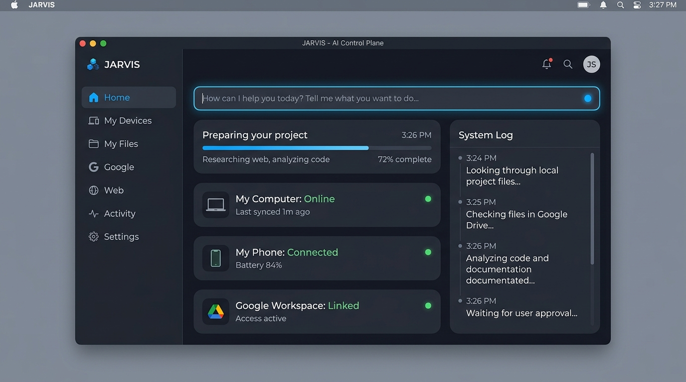
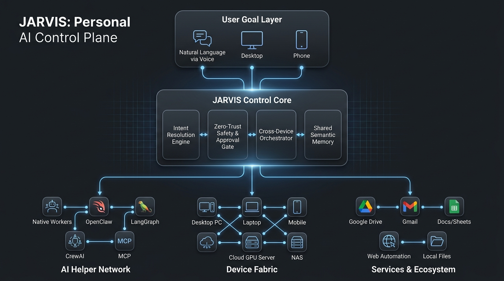
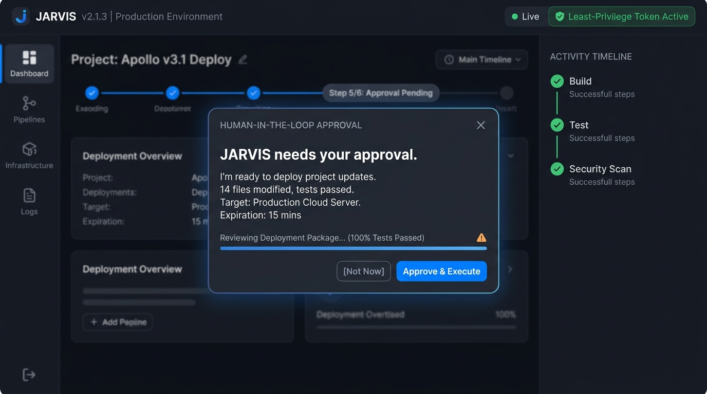
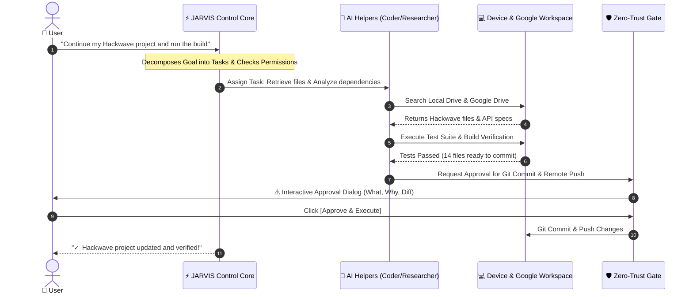

# ⚡ JARVIS: The Personal AI Control Plane

<div align="center">

[](https://www.python.org/)
[](https://github.com/sohail-bhai/jarvis)
[](https://github.com/sohail-bhai/jarvis)
[](https://ollama.ai)
[](https://github.com/sohail-bhai/jarvis)

<p align="center">
  <b>The Unified Operating Layer for AI Helpers, Multi-Device Execution, Google Workspace, and Autonomous Web Workflows.</b>
</p>

> *"The user thinks in goals. JARVIS handles agents, devices, tools, permissions, services, and execution."*

[Explore Architecture](#-system-architecture) • [Key Capabilities](#-core-capabilities) • [Live Demo Workflow](#-the-3-minute-demo-workflow) • [Zero-Trust Security](#-zero-trust-safety--human-in-the-loop) • [Quickstart](#-quickstart-guide)

---

    

</div>

---

## 🎯 Vision & Executive Summary

Most existing AI tools force users to act as **infrastructure managers**: switching between isolated chat windows, pasting API keys, managing Python environments, running separate agent frameworks, and manually synchronizing files across computers, phones, and Google Drive.

**JARVIS fundamentally flips this paradigm.** 

JARVIS is not merely a voice chatbot, a script runner, or an OpenClaw frontend. It is a **Personal AI Control Plane**—a single, elegant, and secure command interface that translates high-level human intent into coordinated, multi-agent execution across every machine, service, and data source you own.

```
                  ┌─────────────────────────────────────────────────┐
                  │                 USER (High-Level Intent)        │
                  │   "Prepare my Hackwave project and run tests"    │
                  └────────────────────────┬────────────────────────┘
                                           │
                                           ▼
                  ┌─────────────────────────────────────────────────┐
                  │           ⚡ JARVIS AI CONTROL CORE             │
                  │   • Intent Resolution  • Task Decomposition    │
                  │   • Shared Semantic RAG • Zero-Trust Gate       │
                  └──────┬─────────────────┬─────────────────┬──────┘
                         │                 │                 │
                         ▼                 ▼                 ▼
             ┌──────────────────────┐ ┌───────────────┐ ┌──────────────────────┐
             │   AI HELPER MESH     │ │ DEVICE FABRIC │ │ SERVICES & ECOSYSTEM │
             │ Native • OpenClaw    │ │ Desktop / PC  │ │ Google Workspace     │
             │ LangGraph • CrewAI   │ │ Cloud GPU     │ │ Drive, Gmail, Docs   │
             │ MCP Agent Protocols  │ │ Mobile / Phone│ │ Autonomous Web / OS  │
             └──────────────────────┘ └───────────────┘ └──────────────────────┘
```

---

## 🏛️ System Architecture

JARVIS is architected as a modular, resilient, and framework-agnostic control fabric:

<div align="center">



</div>

### Architectural Layers

| Layer | Component | Description |
| :--- | :--- | :--- |
| **1. Goal Ingestion** | **Omni-Channel Interface** | Accepts human goals via natural voice (`pvporcupine` + `pyttsx3`), desktop GUI (`customtkinter`), remote Telegram bots, or CLI. |
| **2. Control Core** | **Brain & Intent Engine** | Powered by local LLMs (Ollama `qwen2.5`) with multi-step recursive reasoning, dynamic tool selection, and short/long-term ChromaDB vector memory. |
| **3. Safety & Policy** | **Zero-Trust Guard (`guard.py`)** | Strict interception boundary evaluating every tool call against permission tiers (`safe`, `sensitive`, `destructive`). Emits append-only redacted audit logs. |
| **4. Helper Network** | **Framework-Agnostic Mesh** | Coordinates native sub-agents, OpenClaw nodes, LangGraph pipelines, CrewAI swarms, and MCP servers without vendor lock-in. |
| **5. Device Fabric** | **Cross-Machine Execution** | Dynamically routes workloads to local desktop, remote cloud GPUs, secondary laptops, or mobile endpoints based on task needs. |
| **6. Workspace Layer** | **Google Ecosystem Engine** | First-class OAuth 2.0 integration with Google Drive (semantic search), Gmail (draft/summary), Calendar, and Docs/Sheets. |
| **7. Physical Layer** | **Overwatch & Vision Engine** | Real-time UIAutomation & PyAutoGUI scanning with rate-limited autonomous background screen inspection and auto-approval rules. |

---

## 🚀 Core Capabilities

### 1. 🤖 Framework-Agnostic AI Helper Mesh
Never be locked into a single AI agent ecosystem. JARVIS abstracts agent frameworks into a unified **AI Helper Registry**:
- **Capability-Based Discovery**: Don't pick servers or protocols—tell JARVIS *"Train this model"*, and it automatically discovers and assigns the ML Helper.
- **Inter-Helper Handoff**: A coding helper needing a GPU passes context to an ML Helper on a remote machine, collects the output, and continues its task.
- **Actor-Critic Research Swarms**: Spawns concurrent research, review, and verification sub-agents that autonomously critique and refine deliverables.

### 2. 🛡️ Zero-Trust Safety & Human-in-the-Loop
Autonomous agents should never have blanket access to your life or filesystem.
- **Task-Scoped Micro-Permissions**: Temporary grants (e.g., Read + Write limited to `project/` for 30 minutes).
- **Interactive Approval Modals**: Destructive or consequential actions (file modifications, code commits, database operations, emails, terminal execution) pause execution until approved via GUI card or Telegram prompt.
- **Hardware Emergency Kill-Switch**: Instantly freeze all active tasks and revoke all temporary credentials at any moment with **`Ctrl+Alt+Shift+K`**.
- **Tamper-Evident Audit Stream**: Every action is redacted of secrets and logged in real-time to an append-only audit ledger (`logs/audit.jsonl`).

<div align="center">



</div>

### 3. 👁️ Autonomous Overwatch Engine
Built for intense multi-tasking workflows (e.g. hackathons, CI builds, software compilation):
- **Background Screen Monitor**: Continuously monitors designated active windows (e.g., IDE build popups, terminal confirmations) without stealing mouse focus.
- **Intelligent Auto-Approval**: Evaluates screen state against configured policy rules to automatically acknowledge non-critical progress prompts (e.g., clicking *"Proceed"*, *"Submit"*, *"Yes"*).
- **Z-Order Aware & Rate-Limited**: Strictly limits action velocity to prevent runaway clicks and verifies window hierarchy in real-time.

### 4. 🌐 Unified Google Workspace & Cross-Device Fabric
- **Natural Language Workspace Actions**: *"Find my Hackwave presentation and turn the research notes into a Google Doc."*
- **Cross-Device File Resolution**: Searches across local drives, secondary laptops, connected storage, and Google Drive simultaneously.
- **Context-Preserving Remote Sync**: Seamlessly transitions execution from your desktop to your mobile device via Telegram without losing state.

### 5. 📜 The "System Log": Observable, Non-Opaque AI
Say goodbye to cryptic terminal outputs and dangerous hallucinated hidden reasoning:
- The signature right-side **System Log** renders real-world, observable actions in clean, plain English:
  ```text
  [12:34:01] [INFO]   Looking through your local files for "Hackwave presentation"...
  [12:34:03] [INFO]   Found 3 matching project documents.
  [12:34:04] [INFO]   Searching connected Google Drive for supplementary slides...
  [12:34:06] [TOOL]   Activating Web Research Helper for latest market data...
  [12:34:10] [WARN]   JARVIS needs your approval: Ready to commit 14 modified files.
  ```

---

## 🎬 The 3-Minute Demo Workflow

Experience how JARVIS turns a high-level goal into reality:



---

## 🕹️ Comparison: Why JARVIS Wins

| Capability | Traditional Chatbots | Single-Agent Tools | OpenClaw Alone | ⚡ JARVIS Control Plane |
| :--- | :---: | :---: | :---: | :---: |
| **Paradigm** | Question / Answer | Single Task Execution | Gateway / Node Transport | **Goal-Oriented Control Plane** |
| **Framework Independence** | ❌ None | ❌ Framework Locked | ❌ Custom Protocol | **✅ Agnostic (OpenClaw/CrewAI/MCP)** |
| **Multi-Device File & Execution** | ❌ No | ❌ Host Only | ⚠️ Manual SSH/Transfer | **✅ Automated Cross-Device Mesh** |
| **Google Workspace Native** | ❌ No | ⚠️ Partial Plugins | ❌ No | **✅ Full Workspace OAuth Fabric** |
| **Human-in-the-Loop Safety** | ❌ No | ⚠️ Basic Prompts | ❌ Host Level | **✅ Zero-Trust Gate + Hard Kill-Switch** |
| **Autonomous UI Overwatch** | ❌ No | ❌ No | ❌ No | **✅ Real-Time Screen Auto-Action** |
| **Observable Activity UI** | ❌ Terminal Logs | ❌ Opaque CoT | ❌ CLI Output | **✅ Plain-English System Log** |

---

## ⚡ Quickstart Guide

### Prerequisites
- **OS**: Windows 10/11 (or macOS / Linux with core feature set)
- **Python**: 3.10 to 3.12 recommended
- **Local AI Engine**: [Ollama](https://ollama.ai) installed with `ollama run qwen2.5:3b`

### 1. Installation

```bash
# Clone the repository
git clone https://github.com/sohail-bhai/jarvis.git
cd jarvis

# Create and activate a clean virtual environment
python -m venv venv
venv\Scripts\activate      # On Windows
# source venv/bin/activate # On Linux/macOS

# Install dependencies
pip install -r requirements.txt
```

### 2. Configuration (`config.json`)
Personalize names, models, and safety levels directly in `config.json`:

```json
{
  "user_name": "Sohail",
  "assistant_name": "Jarvis",
  "llm_model": "qwen2.5:3b",
  "wake_word_enabled": true,
  "safety": {
    "voice": { "confirm_destructive": true },
    "telegram": { "confirm_sensitive": true, "confirm_destructive": true }
  },
  "overwatch": {
    "max_z_order": 3,
    "scan_interval": 1.0,
    "rules": [
      { "target_text": "submit", "auto_click": true, "pattern": "exact" },
      { "target_text": "proceed", "auto_click": true, "pattern": "exact" }
    ]
  }
}
```

### 3. Launching JARVIS

#### 🖥️ Launch the Modern Desktop Control Dashboard
```bash
python jarvis_gui.py
```
*Access the interactive interface with the Live Orb, System Log, Overwatch controls, and single-click task approvals.*

#### 🎙️ Launch in Continuous Headless / Voice Mode
```bash
python main.py
```

#### 🛡️ Safe Verification Modes
```bash
# Run isolated smoke test (stubs desktop side effects)
python main.py --smoke-test

# Test single command without speech
python main.py --text "what time is it" --no-speech
```

---

## ⌨️ Emergency Keyboard Shortcuts

| Shortcut | Action | Scope |
| :--- | :--- | :--- |
| <kbd>Ctrl</kbd> + <kbd>Shift</kbd> + <kbd>Space</kbd> | **Interrupt Speech** | Instantly silences JARVIS TTS speech output. |
| <kbd>Ctrl</kbd> + <kbd>Alt</kbd> + <kbd>Shift</kbd> + <kbd>K</kbd> | **GLOBAL KILL-SWITCH** | Freezes all active tasks, revokes temporary tokens, and blocks all tool calls. |

---

## 🗺️ Engineering Roadmap

- [x] **Phase 0: Foundations** — Bounded event bus, unified logging, append-only JSONL audit ledger.
- [x] **Phase 1: Safety Gate** — Context-aware permissions (`guard.py`), unified prompt broker (`confirm.py`).
- [x] **Phase 2: Autonomous Overwatch** — COM-initialized background UIAutomation scanner with rule matching and rate limiting.
- [x] **Phase 3: Control Dashboard** — Live System Log, Overwatch status card, and dynamic confirmation cards.
- [ ] **Phase 4: Helper Network Fabric** — Plug-and-play adapter connectors for OpenClaw nodes, LangGraph, and MCP servers.
- [ ] **Phase 5: Google Workspace Cloud Sync** — Full bi-directional Drive semantic indexer and Gmail action drafting.

---

## 👥 Contributors & Acknowledgments

Engineered with passion for the Hackathon by **Sohail & Team**. Special thanks to the open-source communities behind **Ollama**, **CustomTkinter**, and **UIAutomation**.

<div align="center">
  <sub>Built for the future of human-agent collaboration.</sub>
</div>
